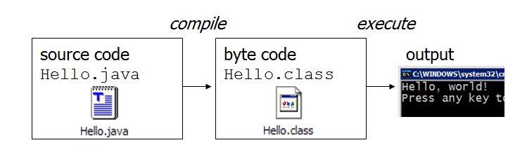
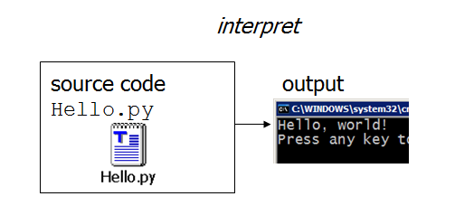

# Compilation Vs Interpretation
- Many languages require you to compile (translate) your program into a form that the machine understands.
 <!-- .element: style="border:0; display:block; margin:auto;" -->
- Python is a hybrid of byte-code interpreted and/or compiled language.
<!-- .element: style="border:0; display:block; margin:auto;" -->