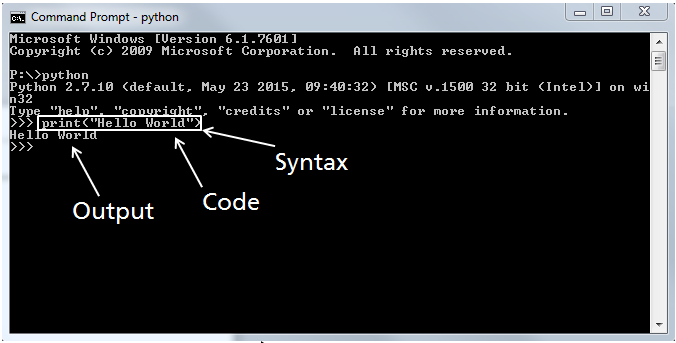

# Programming Basics
- **code** or **source code**: The sequence of instructions in a program.
- **syntax**: The set of legal structures and commands that can be used in a particular programming language.
- **output**: The messages printed to the user by a program.
- **console**: The text box onto which output is printed.
    - Some source code editors pop up the console as an external window, and others contain their own console window.
    - console: <!-- .element: style="border:0; display:block; margin:auto;" -->
