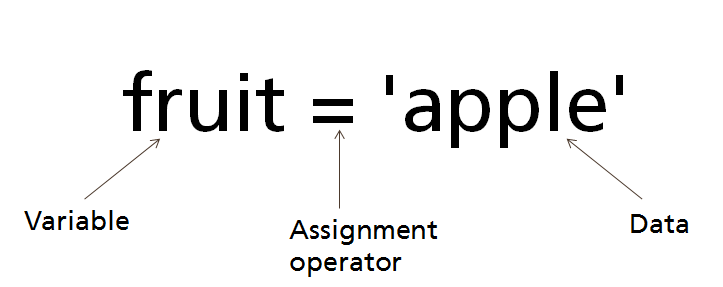

# Variables
- Variables are a named piece of memory that can store data (values).
    - <!-- .element: style="border:0; width:300px" -->
- Usage:
    - Compute an expression's result
    - store that result into a variable, and use that variable later in the program.
- Naming rules:
    - Use short but descriptive names
    - Only alphanumeric symbols are allowed: A-z, 0-9, _
    - Names can't start from number
    - Names can start with an underscore _
    - Names are case-sensitive!
