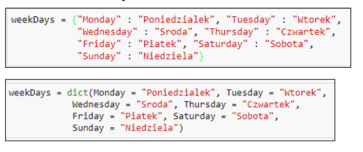
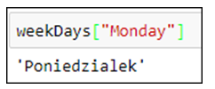
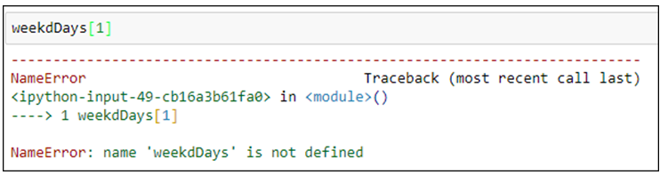

# Dictionaries

- Create Dictionary

<!-- .element: style="border:0; width:30%" -->

- Accessing Items

<!-- .element: style="border:0; width:20%" -->

- The wrong way

<!-- .element: style="border:0; width:50%" -->