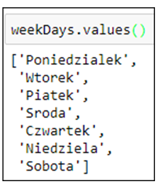

# Dictionaries, in a nutshell

- Creating a new dictionary

```
newDict = {key: value}
```

- Keys

<!-- .element: style="border:0; width:50%" -->

- Values

<!-- .element: style="border:0; width:20%" -->
