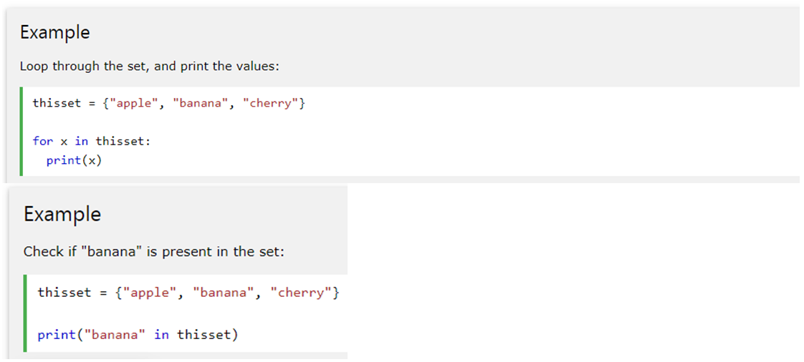

# Access Items

- You cannot access items in aset by referring to an index, since sets are unordered the items have no index. But you can loop through the set using a *for* loop, or ask if a specific value is present using the *in* keyword
<!-- .element: style="border:0; width:100%" -->
