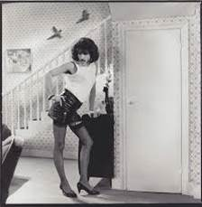

# I want to **break** free! 
- The **break** statement is a shortcut to jump out of while loops immediately. 
```
rooms_to_hoover = 5
hoover_works = True
while (hoover_works == True) and (rooms_to_hoover > 0):
    print('i am busy')
    rooms_to_hoover = rooms_to_hoover - 1
    if rooms_to_hoover == 3:
        break
```
- How many times "I am busy" will be printed?
- Python syntax is simply **break** keyword placed inside the loop. Once reached, loop will end.
<!-- .element: style="border:0; width:250px; margin-top:20px; margin-right:500px; float:right";  -->
