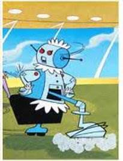

# **continue** hoovering until it's done
- The **continue** statement is a shortcut to jump back to the start of the loop and reevaluates the loop’s condition. Both **break** and **continue** statements are used inside loops. 
```
rooms_to_hoover = 5
hoover_works = True
while (hoover_works == True) and (rooms_to_hoover > 0):
    print('i am busy')
    rooms_to_hoover = rooms_to_hoover - 1
    constinue
    if rooms_to_hoover == 3:
        break
```
- How many times "I am busy" will be printed?
- Python syntax is simply **continue** keyword placed inside the loop.
<!-- .element: style="border:0; width:180px; margin-top:20px; margin-right:200px; float:right";  -->