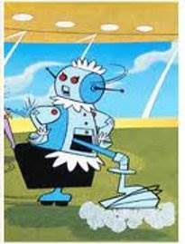

# **for** all_rooms **in range** of my_house
- The for loop is used to run block of code only a certain number of times. 
```
for rooms_to_hoover in range(5):
    print('I am busy')
```
- How many times "I am busy" will be printed?
- Python syntax: **for** keyword, a variable name, **in** keyword, call to the **range()** method with up to three integers passed to it, colon, indented block of code starting from next line.
- *range(x, [y, z]) returns a list, or similar valued data: Used to generate data for the loop
<!-- .element: style="border:0; width:200px; margin-top:20px; margin-right:200px; float:right";  -->


